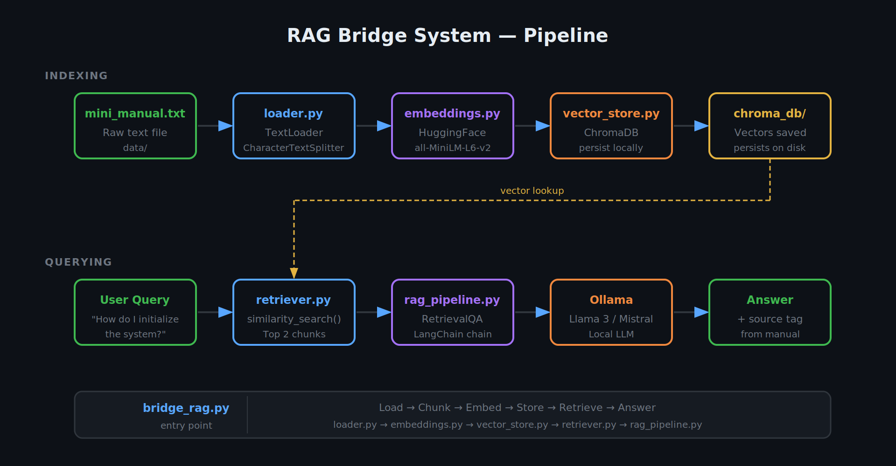

# RAG Bridge System

## Overview
A simple Retrieval-Augmented Generation (RAG) pipeline using:
- LangChain
- ChromaDB
- Sentence Transformers
- Ollama (Llama3/Mistral)

## Pipeline


## Setup
pip install -r requirements.txt

## Run
python bridge_rag.py

## Example Query
"What departments are available in Cairo University Faculty of Engineering?"

## Output
- Top 2 relevant chunks
- Final answer with source

## Structure
```
rag-bridge-system/
│
├── data/
│   └── mini_manual.txt
│
├── chroma_db/              
│
├── src/
│   ├── loader.py           # load + chunk text
│   ├── embeddings.py       # embedding model setup
│   ├── vector_store.py     # chroma setup + persistence
│   ├── retriever.py        # similarity search
│   └── rag_pipeline.py     # RetrievalQA chain
│
├── bridge_rag.py           # main script (entry point)
│
├── requirements.txt
├── README.md
└── .gitignore
```
